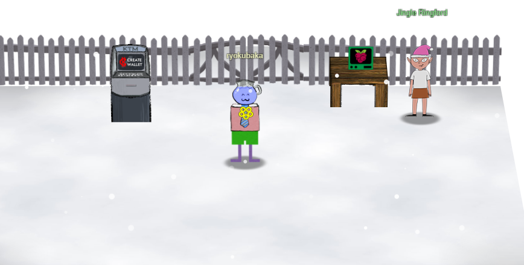
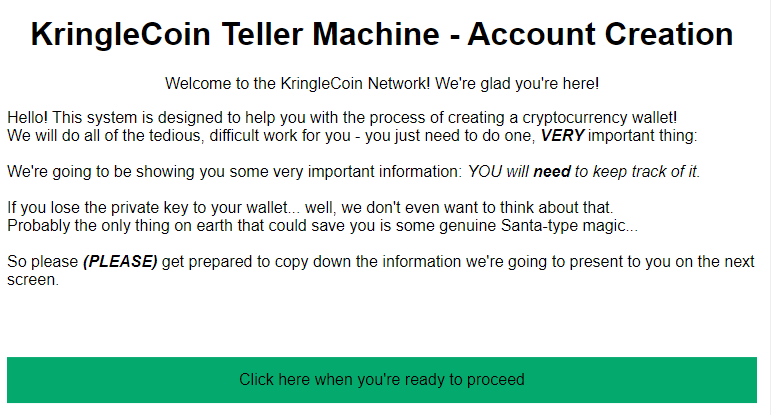
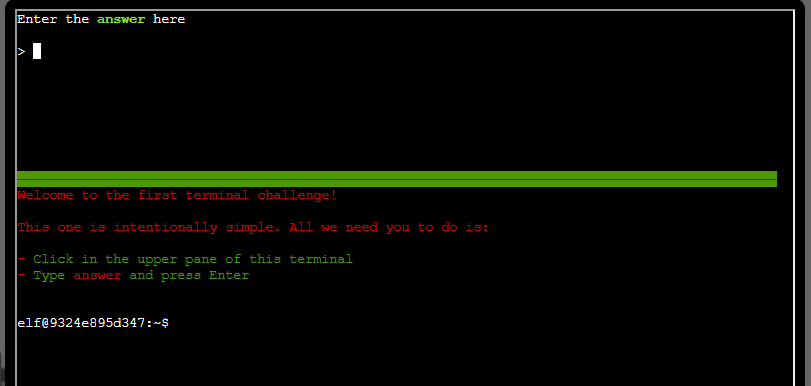

# Orientation



We're in - SANS HHC 2022 begins!

We start by speaking with `Jingle Ringford`, who gives us our yellow badge and tells us to use the KringleCoin Teller Machine (KTM) and grab our crypto wallet.

Upon entering and interacting with the KringleCoin Teller Machine, it asks you to create a Crypto wallet.



I am tracking these values here, as we are told how important it is to hold onto these (generally you never want to share your private key, of course, but this isn't a real wallet after all):

```
WalletAddress: 0xb8D8Ba6d6CBAEE0089520457F4FCc6d95Bb67FbD
Key: 0xfd68834c4a0465a84e58a0bd7a66b481be9cdda213b4b49b492e82a53ad39582
```

## Terminal Prompt 1

After grabbing our wallet address/private key, we speak with Jingle Ringfort again and he asks us to use the terminal.



This is just a simple demonstration of how terminals work. We type `answer` in the top terminal section, and get 5 gold coins as a reward.

After solving this super difficult problem, the gates open up, and we enter [KringleCon](../2-northpole/1-northpole.md)!