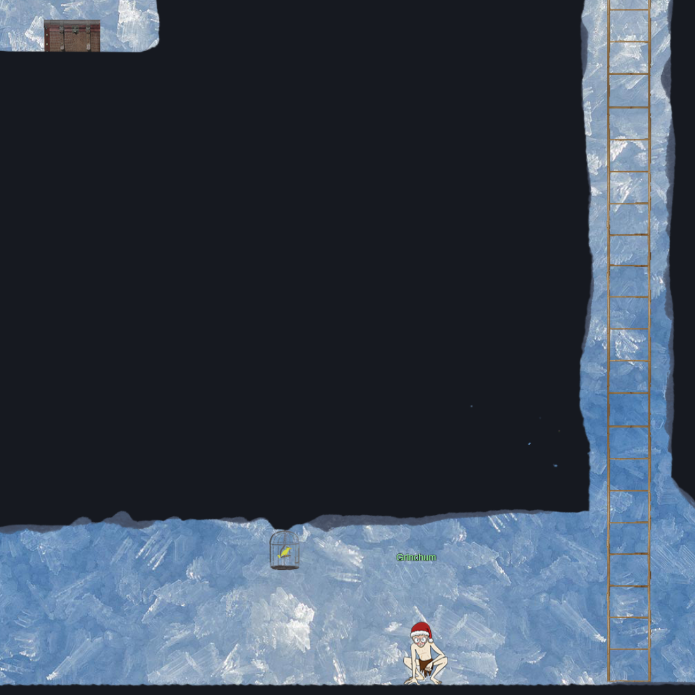
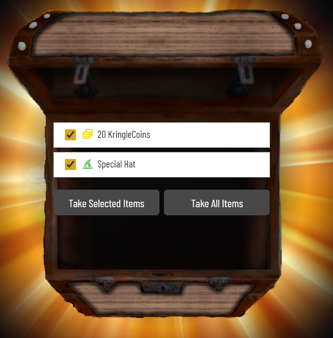

# North Pole Subterranean Labyrinth

We go down a long ladder and see to the left the `Hall of Talks` room that hosts all of our Security experts Youtube talks. However, walking past the talks, we see a juicy chest!

This gave us some coins, and this nice hint:

Going back out and down further, we see a room to the right and `Grinchum` to the left. Off further left is another ladder further down. Talking to Grinchum doesn't give us any info, just something about his *precious*.

There's also a chest to the left, which we can reach by moving to the left while on the ladder just above the ground.

Let's head into the [Tolkien Ring room](../3-rings/1-tolkien/README.md).

---

After we've captured the Tolkien Ring, we continue down the labyrinth past Grinchum.

We see `Morcel Nougat`, and the Elfen Ring room. Morcel doesn't tell us much, so we head into the [Elfen Ring room](../3-rings/2-elfen/README).

---
After grabbing the Elfen Ring, we head deeper into the labyrinth.

We find `Tangle Coalbox` and the Web Ring room. Tangle says some nonsense about Flobbits. Let's head into the [Web Ring room](../3-rings/3-web/README).

---
Now that we've secured 3 of the 5 rings, we head back out and to the left. As I was about to go deeper down, I noticed a rope to the left. So, we climb up and to left to find a chest!

Now we head a little bit deeper into the labyrinth, and find the `Cloud Ring` room to our left, along with `Brozeek` and `Crozag` chilling to our right.

Into the [`Cloud Room`](../3-rings/4-cloud/README) we go!

---

As we head deeper down, we see a chest to the right and the final ring room below.

We first capture the chest (free hat!) by heading to the very bottom, moving right, and then up (and left, and up, and right, and.... yeah, lots of buttom spamming - but we get there, lol.)

Now we head into the [Burning Ring of Fire](../3-rings/5-burningringoffire/README.md) room!