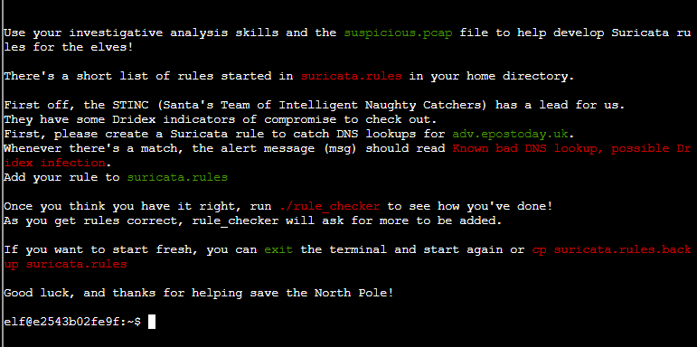
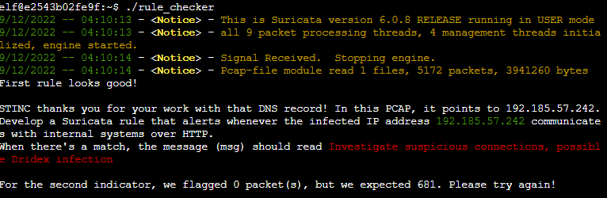
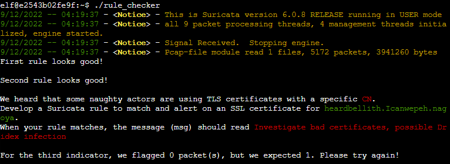
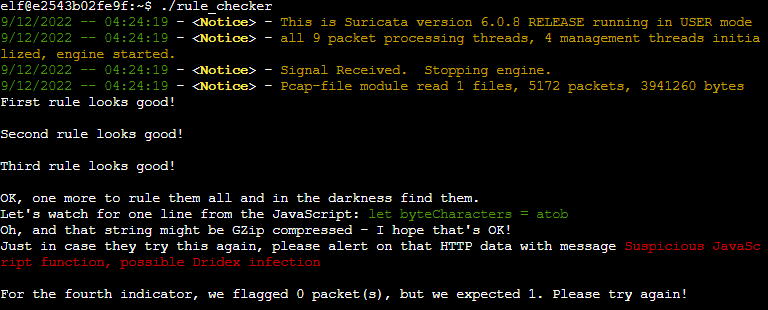

# Suricata Regatta



In our `suricata.rules`, we see:

```
alert http any any -> any any (msg:"FILE tracking PNG (1x1 pixel) (1)"; filemagic:"PNG image data, 1 x 1,"; sid:19; rev:1;)
alert http $EXTERNAL_NET any -> $HOME_NET any (msg:"ET HUNTING Possible ELF executable sent when remote host claims to send a Text File"; flow:established,from_server; http.header; content:"Content-Type|3a 20|text/plain"; file.data; content:"|7f 45 4c 46|"; startswith; fast_pattern; isdataat:3000,relative; classtype:bad-unknown; sid:2032973; rev:1; metadata:updated_at 2021_05_18;)

alert ip any any -> any any (msg:"SURICATA IPv4 invalid checksum"; ipv4-csum:invalid; classtype:protocol-command-decode; sid:2200073; rev:2;)

alert ip [199.184.82.0/24,199.184.223.0/24] any -> $HOME_NET any (msg:"ET DROP Spamhaus DROP Listed Traffic Inbound group 27"; reference:url,www.spamhaus.org/drop/drop.lasso; threshold: type limit, track by_src, seconds 3600, count 1; classtype:misc-attack; flowbits:set,ET.Evil; flowbits:set,ET.DROPIP; sid:2400026; rev:3398; metadata:updated_at 2022_10_06;)

alert dns $HOME_NET any -> any any (msg:"ET WEB_CLIENT Malicious Chrome Extension Domain Request (stickies .pro in DNS Lookup)"; dns.query; content:"stickies.pro"; nocase; sid:2025218; rev:4;)

alert tcp any any -> any any (msg:"SURICATA Applayer No TLS after STARTTLS"; flow:established; app-layer-event:applayer_no_tls_after_starttls; flowint:applayer.anomaly.count,+,1; classtype:protocol-command-decode; sid:2260004; rev:2;)

alert pkthdr any any -> any any (msg:"SURICATA IPv4 total length smaller than header size"; decode-event:ipv4.iplen_smaller_than_hlen; classtype:protocol-command-decode; sid:2200002; rev:2;)

alert udp any any -> any 123 (msg:"ET DOS Possible NTP DDoS Inbound Frequent Un-Authed GET_RESTRICT Requests IMPL 0x02"; content:"|00 02 10|"; offset:1; depth:3; byte_test:1,!&,128,0; byte_test:1,&,4,0; byte_test:1,&,2,0; byte_test:1,&,1,0; threshold: type both,track by_dst,count 2,seconds 60; classtype:attempted-dos; sid:2019021; rev:3; metadata:created_at 2014_08_26, updated_at 2014_08_26;)
```

### Task 1: Catch DNS lookup

- Provided a base *suricata.rules* (above), which we must modify
- Looking for any DNS lookups to **adv.epostoday.uk**
- When we find a match, we need to write a msg alert that reads **Known bad DNS lookup, possible Dridex infection**.

Answer: **alert dns any any -> any any (msg:"Known bad DNS lookup, possible Dridex infection"; dns.query; content:"adv.epostoday.uk"; nocase; sid:1000;)**

---

### Task 2: Catch IP communication with internal systems over HTTP



- Looking for **tcp/80** communication with **192.185.57.242**
- When we find a match, we need to write a msg alert that reads **Investigate suspicious connections, possible Dridex infection**

Answer: **alert http $HOME_NET any <> 192.185.57.242 any (msg:"Investigate suspicious connections, possible Dridex infection"; sid:1001;)**

---

### Task 3: Catch SSL certificate



- Looking for SSL certificate for **heardbellith.Icanwepeh.nagoya**
- When we find a match, we need to write a msg alert that reads **Investigate bad certificates, possible Dridex infection

Answer: **alert tls any any -> any any (msg:"Investigate bad certificates, possible Dridex infection"; content:"heardbellith.Icanwepeh.nagoya"; nocase; sid:1002;)**

---

### Task 4: Catch GZip Compressed String from HTTP data



- Looking for gzip compressed string in the HTTP traffic that reads **let byteCharacters = atob**
- When we find a match, we need to write a msg alert that read **Suspicious JavaScript function, possible Dridex infection**

Answer: **alert http $HOME_NET any <> any any (msg:"Suspicious JavaScript function, possible Dridex infection"; http.response_body; content:"let byteCharacters = atob"; sid:1003;)**

---

## All answers together:

**alert dns any any -> any any (msg:"Known bad DNS lookup, possible Dridex infection"; dns.query; content:"adv.epostoday.uk"; nocase; sid:1000;)**
**alert http $HOME_NET any <> 192.185.57.242 any (msg:"Investigate suspicious connections, possible Dridex infection"; sid:1001;)**
**alert tls any any -> any any (msg:"Investigate bad certificates, possible Dridex infection"; content:"heardbellith.Icanwepeh.nagoya"; nocase; sid:1002;)**
**alert http $HOME_NET any <> any any (msg:"Suspicious JavaScript function, possible Dridex infection"; http.response_body; content:"let byteCharacters = atob"; sid:1003;)**