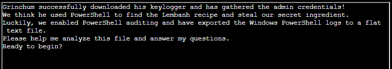

# Windows Event Logs



### **Question 1. What month/day/year did the attack take place? For example, 09/05/2021**

1. I first want the data in a more digestible format. I used Eric Zimmerman's `EvtxECmd` tool to convert the data to json:

    `.\EvtxECmd\EvtxECmd.exe -f .\powershell.evtx --json "\jsondir"`

2. Now, using my Kali WSL terminal and Jq, we can easily parse this. Let's see what dates exist.

    `cat 20221208232521_EvtxECmd_Output.json | jq '.TimeCreated' | cut -c2-11 | uniq`

    The result of this is:

    ```
    2022-10-13
    2022-11-01
    2022-11-11
    2022-11-19
    2022-11-26
    2022-12-04
    2022-12-13
    2022-12-18
    2022-12-23
    2022-12-24
    ```

    We can go through each of the dates, but this is a Christmas themed event, so...

Answer: **12/24/2022**

---

### **Question 2. An attacker got a secret from a file. What was the original file's name?**

1. For this, it's easiest to just open the file in Event Viewer and search the term "secret". Searching the event file for the term "secret" and we see that it's referenced as a *secret ingredient*. We just need the filename.

2. Scrolling up a view log entries before the output of the file is displayed in an event, we find an entry with `event ID 4104` (remote command), which is:

`cat .\Recipe`

Answer: **Recipe**

---

### **Question 3. The contents of the previous file were retrieved, changed, and stored to a variable by the attacker. Submit the full PowerShell line that performed only these three actions.**

1. Let's use Jq again to see all of the relevant commands executed. I know he's doing a replace operation and storing into a variable (called foo), so our final filter is on that.

    `cat 20221208232521_EvtxECmd_Output.json | jq 'select(.EventId == 4104)' | jq .Payload | awk -F'.*ScriptBlockText' '{print $2}' | sort | grep \$foo | cut -d':' -f2`

The output:

```
\"$foo | Add-Content -Path 'Recipe'\"},{\"@Name\"
\"$foo | Add-Content -Path 'Recipe.txt'\"},{\"@Name\"
\"$foo | Add-Content -Path 'Recipe.txt'\"},{\"@Name\"
\"$foo | Add-Content -Path 'Recipe.txt'\"},{\"@Name\"
\"$foo | Add-Content -Path 'recipe_updated.txt'\"},{\"@Name\"
\"$foo = Get-Content .\\\\Recipe| % {$_ -replace 'honey', 'fish oil'} $foo | Add-Content -Path 'recipe_updated.txt', \"},{\"@Name\"
\"$foo = Get-Content .\\\\Recipe| % {$_-replace 'honey','fish oil'} $foo | Add-Content -Path 'recipe_updated.txt'\"},{\"@Name\"
\"$foo = Get-Content .\\\\Recipe| % {$_ -replace 'honey', 'fish oil'}\"},{\"@Name\"
\"$foo = Get-Content .\\\\Recipe| % {$_-replace 'honey','fish oil'}\"},{\"@Name\"
\"$foo = Get-Content .\\\\Recipe| % {$_-replace 'honey','fish oil'}\"},{\"@Name\"
```

Unfortunately jq added some unnecessary '`\`' to the line where it references the file, but we can pretty easily see the line it used here.

Answer: `$foo = Get-Content .\Recipe| % {$_ -replace 'honey', 'fish oil'}`

---

### **Question 4. After storing the altered file contents into the variable, the attacker used it to run a separate command that wrong the modified data to a file. Submit the full PowerShell line that performed only this action.**

1. We can grab this from above, as well.

Answer: `$foo | Add-Content -Path 'Recipe.txt'`

---

### **Question 5. What is the new file's name that was created with the previous command?**

1. We can grab this from above, as well. The content is simply being ADDED to the existing Recipe.txt.

Answer: `Recipe.txt`

---

### **Question 6. Were any files deleted (Yes/No)?**

1. With some playing around, we find out that yes, files were deleted. The second and third commands outputted below show the Recipe.txt and recipe_updated.txt being deleted.

`cat 20221208232521_EvtxECmd_Output.json | jq 'select(.EventId == 4104)' | jq .Payload | grep -i del`

```
"{\"EventData\":{\"Data\":[{\"@Name\":\"MessageNumber\",\"#text\":\"1\"},{\"@Name\":\"MessageTotal\",\"#text\":\"1\"},{\"@Name\":\"ScriptBlockText\",\"#text\":\"echo \\\"Dec 18 2022 `nLembanh! Santa wants us to try making some this year. We searched everywhere for this recipe that's supposed to have the secret ingredient to really make it authentic. It's gonna be delicious, I'm so excited!\\\" &gt;&gt; mydiary.txt\"},{\"@Name\":\"ScriptBlockId\",\"#text\":\"87fd045c-e1d0-4333-9b1e-7498f4ac7e98\"},{\"@Name\":\"Path\"}]}}"
"{\"EventData\":{\"Data\":[{\"@Name\":\"MessageNumber\",\"#text\":\"1\"},{\"@Name\":\"MessageTotal\",\"#text\":\"1\"},{\"@Name\":\"ScriptBlockText\",\"#text\":\"del .\\\\Recipe.txt\"},{\"@Name\":\"ScriptBlockId\",\"#text\":\"b0d4f117-b6d4-449b-a179-2c59d6b4f548\"},{\"@Name\":\"Path\"}]}}"
"{\"EventData\":{\"Data\":[{\"@Name\":\"MessageNumber\",\"#text\":\"1\"},{\"@Name\":\"MessageTotal\",\"#text\":\"1\"},{\"@Name\":\"ScriptBlockText\",\"#text\":\"del .\\\\recipe_updated.txt\"},{\"@Name\":\"ScriptBlockId\",\"#text\":\"5cc8d632-8b47-42d8-af27-8e1da0fdcdc2\"},{\"@Name\":\"Path\"}]}}"
```

Answer: `Yes`

---

### **Question 7. Was the original file deleted (Yes/No)?**

1. We see above that yes, it was.

Answer: `Yes`

---

### **Question 8. What is the Event ID of the log that shows the actual command line used to delete the file?**

1. We have actually already been filtering on it the whole time.

Answer: `4104`

---

### **Question 9. Is the secret ingredient compromised (Yes/No)?**

1. We saw from the attacker's commands that it was changed from honey to fish oil.

Answer: `Yes`

---

### **Question 10. What is the secret ingredient?**

Answer: `honey`

---

# **We're done!** 

Back to the [Tolkien room](../README.md)