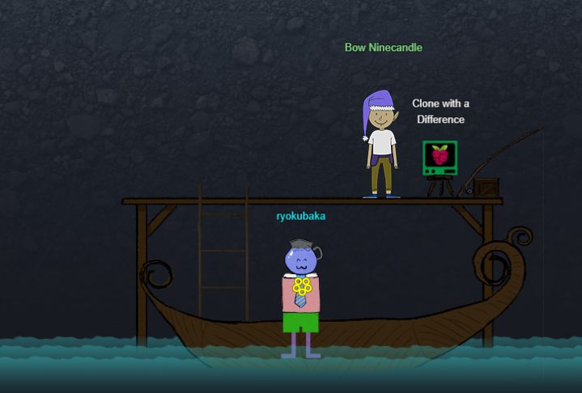
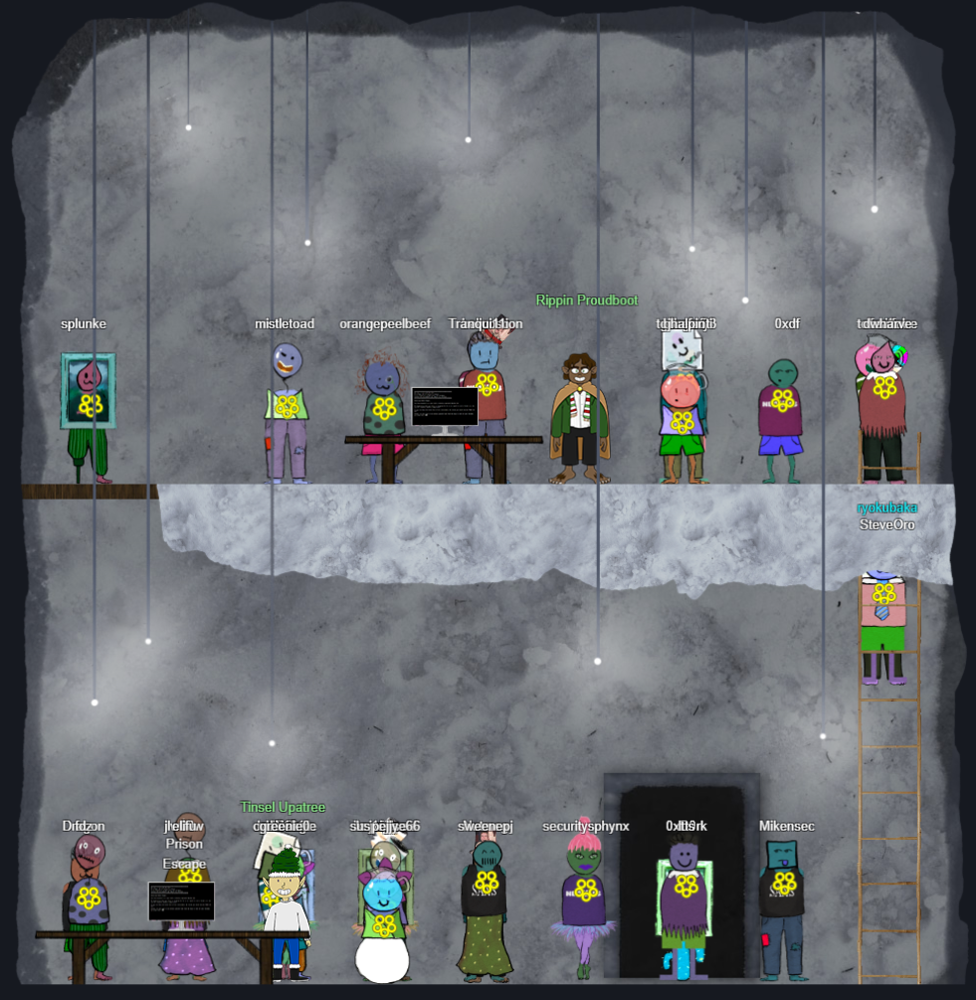

# Elfen Ring Room - Northpole Subterranean Labyrinth

Inside, we go down and jump on a boat, and head to the east.

We come across `Bow Ninecandle` and a challenge [`Clone with a Difference`](clonewithadifference/README).

Completing the challenge, we move further right.  We see a new room with two levels.  

We see `Rippin Proudboot` and `Tinsel Upatree`, as well as two new challenges, but only one is available:

- [`Prison Escape`](prisonescape/README.md)

Only `Prison Escape` is interactable, so we solve that first. After completing it and speaking with `Tinsel Upatree`, we're told about CI/CD pipelines and that Tinsel made an accidental commit to `http://gitlab.flag.net.internal/rings-of-powder/wordpress.flag.net.internal.git`.

Now we can interact with the second challenge:

- [`Jolly CI/CD`](jollycicd/README.md)

After this fun challenge, we earned the glorious **Elfen Ring**! Time to backtrack a bit.

