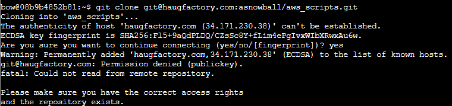
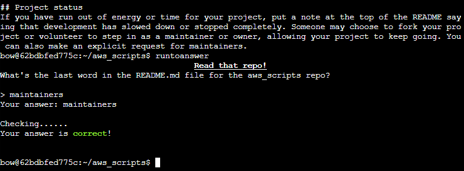

1. Attempting the git clone as recommended errors (as expected):



2. The reason this is failing is that it's attempting an SSH clone, based on the format `git@haugfactory.com`.  We can instead clone via:

`git clone http://haugfactory.com/asnowball/aws_scripts.git` 

3. When we do this and cat the README, we see the last paragraph:

```
## Project status
If you have run out of energy or time for your project, put a note at the top of the README saying that development has slowed down or stopped completely. Someone may choose to fork your project or volunteer to step in as a maintainer or owner, allowing your project to keep going. You can also make an explicit request for maintainers.
```



Answer: **maintainers**