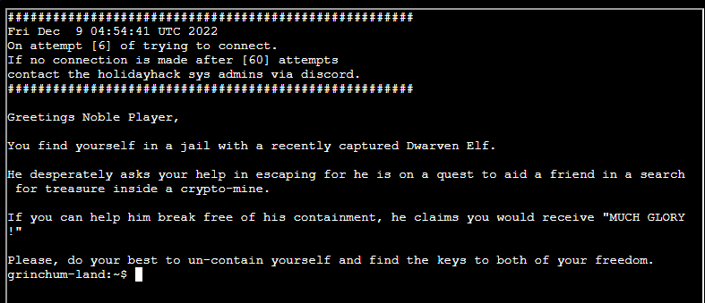
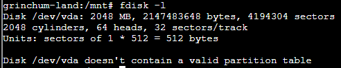
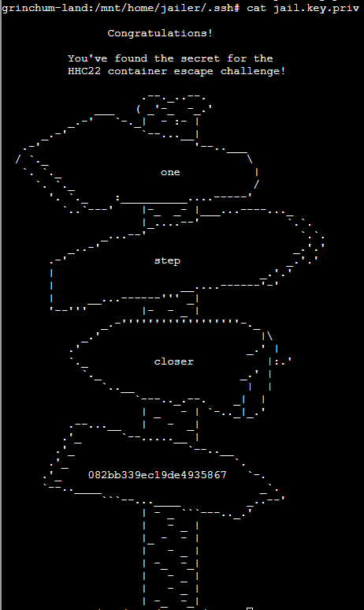
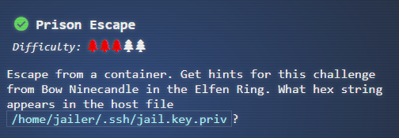

- Upon opening the terminal, we find ourself in a `jail` - likely a hint that we're stuck in a container or very limited shell. We are told to find some `keys`.

1. The first thing I tried was `sudo -i` - which shockingly worked - to get `root` privileges.
2. Running `fdisk -l`, we actually see that `/dev/vda` is presented to the container. Sweet! We can mount it then using `mount /dev/vda /mnt`

3. After mounting `/dev/vda` and navigating to mount, we poke around in key directories (tmp, etc, ....home!)  home/jailer is there, which is interesting. We find `home/jailer/.ssh/jail.key.priv`, and upon reading it, we see:
4. 

Answer: **082bb339ec19de4935867**

... Now that I go to enter in the key, I also see that it told me exactly where to look. Dang it.

