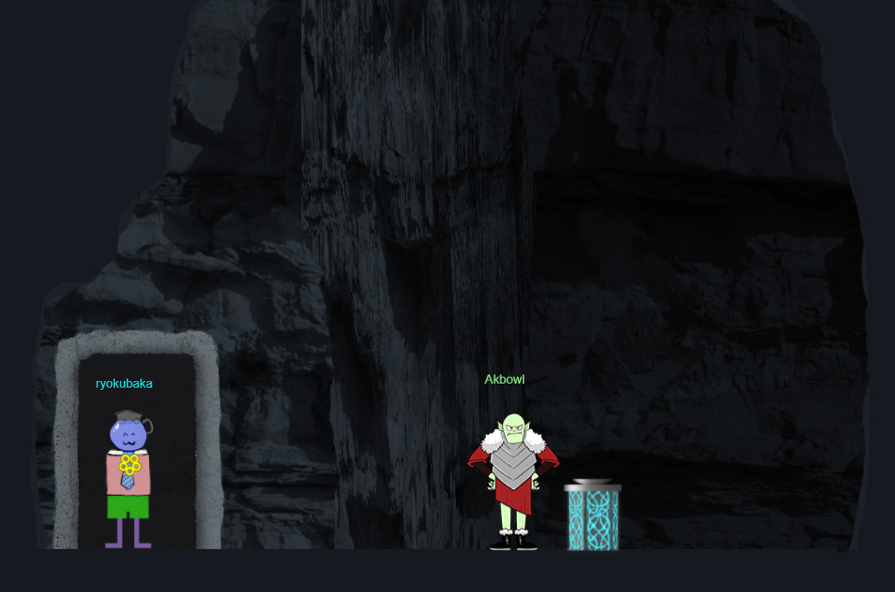

# Web Ring Room - Northpole Subterranean Labyrinth

- Entering the room, we see `Alabaster Snowball` who gives us a  **victim.pcap** and **weberror.log**, which we need to complete the [boria challenges](boriaChallenges/README.md).  Let's complete these first!

- We also see `Hal Tandybuck`, who is standing next to a [Boria Mine Door](boriaminedoor/REAMDE.md) challenge.

- After completing these challenges, we enter a new location and see `Akbowl` next to some kind of [fountain](glamtarielsfountain/README.md). (Note: This challenge was awful in my opinion. WAY too much guessing.)

Once we've secured the Web Ring, we head back into the [labyrinth](../../2-northpole/2-labyrinth.md)!