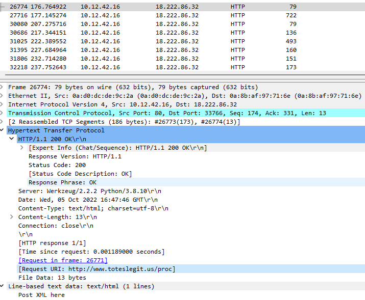

# Boria Challenges

### **Challenge 1: Naughty IP**

- I decided to start with the PCAP provided. One of the first checks I do when looking for suspicious traffic is excessive statistics - large packet count, large data transfers, etc. So, the first thing I do is go to `Statistics -> Conversations`, and view the `IPv4` tab. Visually, we immediately see the standout IP, and we confirm it by sorting by `Packets`

- We further confirm this is malicious in nature by applying the filter `ip.addr==18.222.86.32 && ip.addr==10.12.42.16` and looking for anything interesting. I immediatley noticed multiple `POST /login.html` packets, and thought there may be some brute-force login attempts happening.
- We confirm this suspicion, again, by adding to our filter : `ip.addr==18.222.86.32 && ip.addr==10.12.42.16 && http.request.method == POST` 

 -  - 

Answer: **18.222.86.32**

### **Challenge 2: Credential Mining

- We actually saw this in our filters used in challenge #1. Since we have the packets sorted by packet number by default, and we were inspecting the packets at the top, we already know the username.

Answer: **alice**

### **Challenge 3: 404 FTW**

- We take our previous filter and instead of filtering on POST requests, we'll inspect HTTP GET requests: `ip.addr==18.222.86.32 && ip.addr==10.12.42.16 && http.request.method == GET`.
- Looking at the traffic, we see some normal looking traffic until we hit packet 23352. At that point, we see an excessive amount of GET requests, which looks like attempts at finding a legitimate endpoint.

- We know that a successful URL GET request will return code 200 OK: `ip.addr==18.222.86.32 && ip.addr==10.12.42.16 && http.response.code == 200`

- Looking at the first packet after 23352, we see we received a HTTP 200 OK at `https://www.toteslegit.us/proc`

Answer: **/proc**

### **Challenge 4: IMDS, XXE, and Other Abbreviations**

- Looking at the output of the /proc HTTP request, we see it says `Post XML here` - which is interesting. If we keep inspecting the HTTP 200 responses after the first, we see the malicious actor is receiving sensitive information, such as the contents of /etc/passwd in packet 31025:

- Looking further down at the response packets, we see one where the content contains references to `AccessKeyId`, `SecretAccessKey`, and `Token`. We right click on this packet (32932), and click `Follow -> TCP Stream`
- Looking at the initial request (packet 32918), it looks like an HTTP POST request to the `/proc` URL with XML data provided where it references the IMDS service URL:

Answer: **http://169.254.169.254/latest/meta-data/identity-credentials/ec2/security-credentials/ec2-instance**

Back to the [web room](../README.md)!