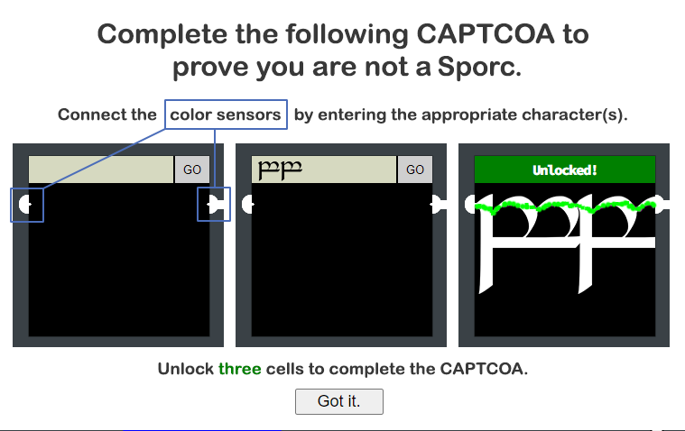
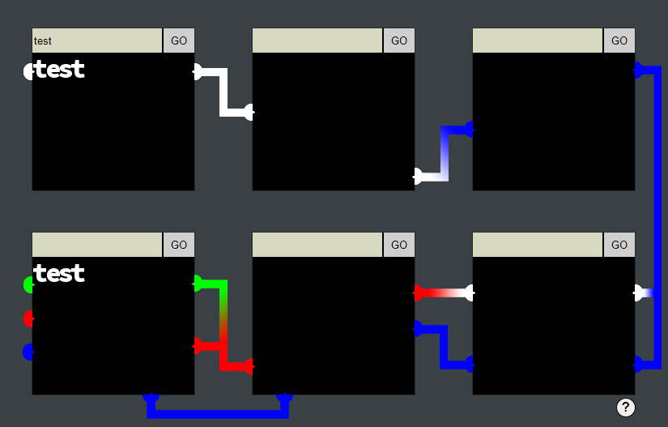
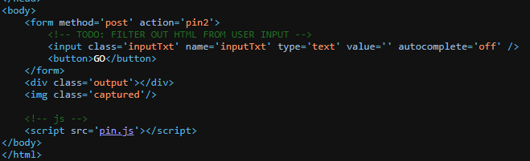

- Interesting concept - probably going to have to use some kind of crazy fonts to make this happen. It looks like we need to provide text that connect together to input to the next node.  Doing a simple test looks like this:



- It took a lot of testing and poking around, but at some point, I decided to look at the source code for one of the pin URL endpoints. In the code, I see this reference:



- This code comment reference to HTML made me realize I could use HTML to modify the size of my input, and also use HTML symbols. So, let's try that!

### Pin 1:

Answer: `<span style='font-size:130px;'>&#9606;&#9606;&#9606;&#9606;</span>`

### Pin 2:

Answer: `<span style='font-size:130px;'>&#9606;&#9606;&#9606;&#9606;</span>`

### Pin 3:

- Two tricks here - unfortunately they're onto us, and it seems like it won't work the same due to an added Content-Security-Policy`: <!-- <meta http-equiv="Content-Security-Policy" content="default-src 'self'; img-src https://*; child-src 'none';"> -->`
- We also need to make the block a different color now!

- I found a site where you can actually make block drawings and play around with the code, where it displays.

Answer: 
```
<svg version="1.1" width="100%" height="100%">
  <rect fill="#0000FF" width="100%" x="0%" y="0%" height="100%"/>
</svg>
```

### Pin 4:

Maybe I'll come back to this - we technically only need 3 completed locks.

