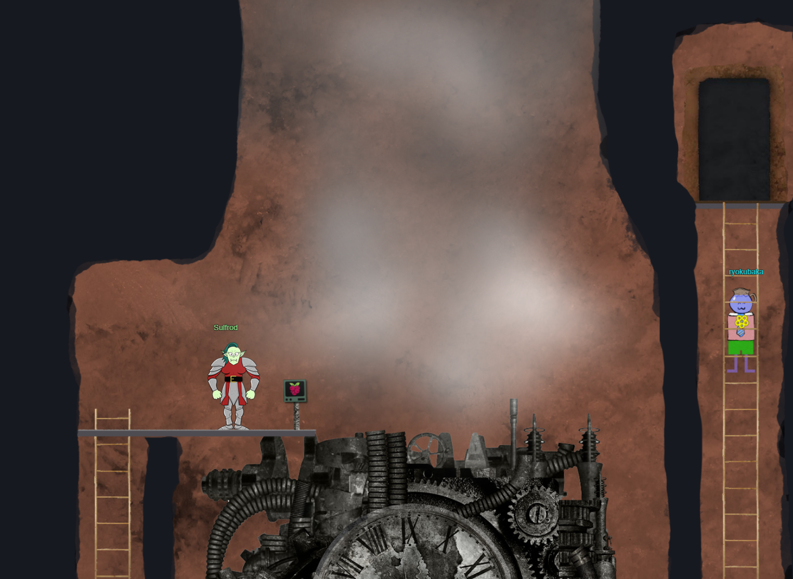
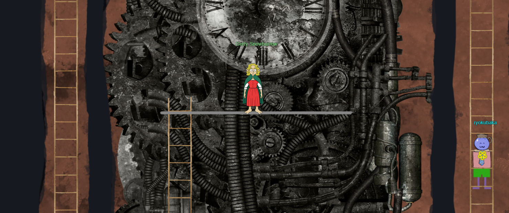
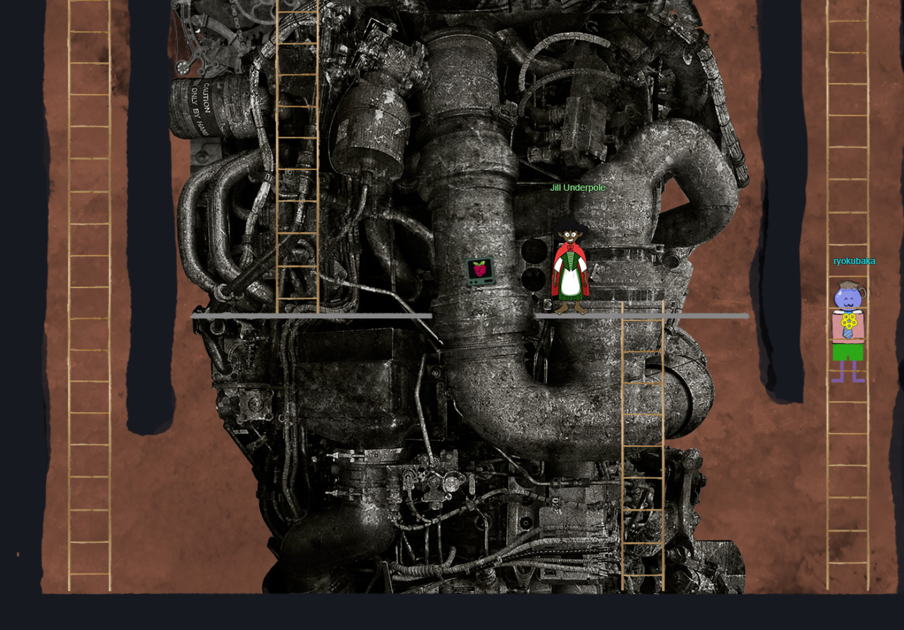
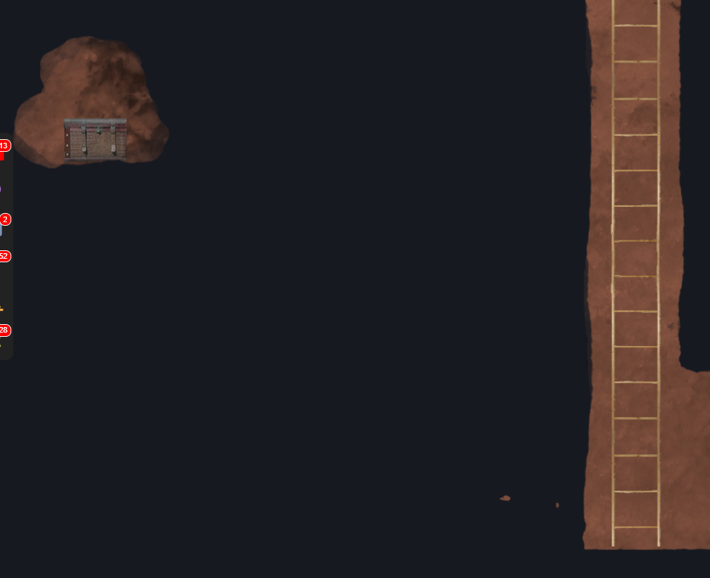
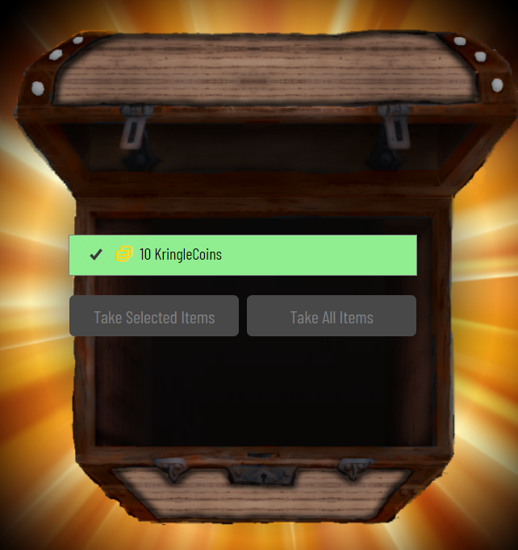

# Cloud Ring Room - Northpole Subterranean Labyrinth

- As we enter, we have to go down a ladder. I'm actually going to do this from the bottom to the top.

- We find `Jill Underpole` at the bottom, standing next to the [`AWS CLI Intro`](awscliintro/README.md) challenge.

- We see `Gerty Snowburrow` in the middle of the room. She tells us that `Alabaster Snowball` committed some secrets to a [code repo](https://haugfactory.com/orcadmin/aws_scripts). Let's document our findings in [`Git Secrets`](gitsecrets/README.md)

- Finally, we see `Sulfrod` along with [`Exploitation via AWS CLI`](awsexploitcli/README.md) challenge at the top (we first saw him to the left as we came into the room)

- We also find a chest at the bottom to the left, behind a secret wall and ladder.

- After we've completed all of the challenges (and captured our chest), we have obtained the `Web Ring` and can head back to the [labyrinth](../../2-northpole/2-labyrinth.md).

