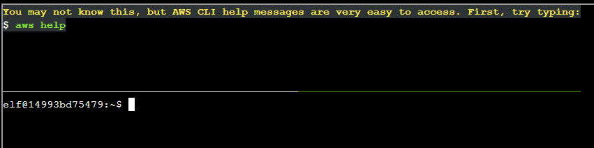
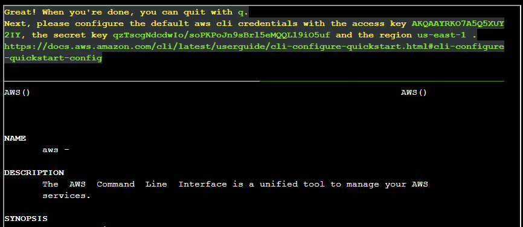
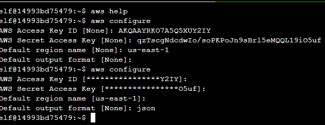
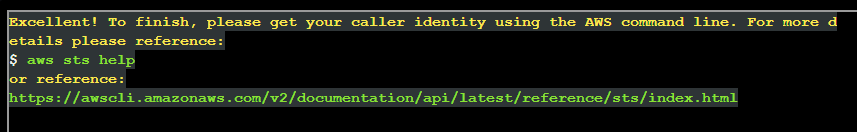
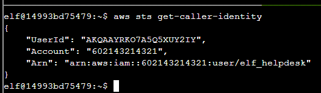

# AWS CLI Intro

### 1:

- So, we type `aws help`

---

### 2:

- It then asks us to configure the default `aws cli` credentials with the provided access and secret key. We run `aws configure` and enter in the values. I did re-run it to ensure I put `json` as my default output format.

---

### 3:

- It asks us to get our caller identity, so we run `aws sts get-caller-identity`:

And that was it! Back to the [cloud ring room](../README.md).