# AWS Exploit CLI

### 1:

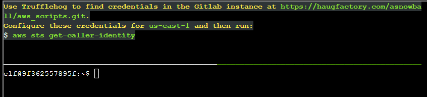

1. Using the info we found in [gitsecrets](../gitsecrets/README.md) (direct link to the Gitlab commit [here](https://haugfactory.com/orcadmin/aws_scripts/-/commit/106d33e1ffd53eea753c1365eafc6588398279b5), we run `aws configure` and enter in the AWS Access Key ID, Secret Access Key, and region:

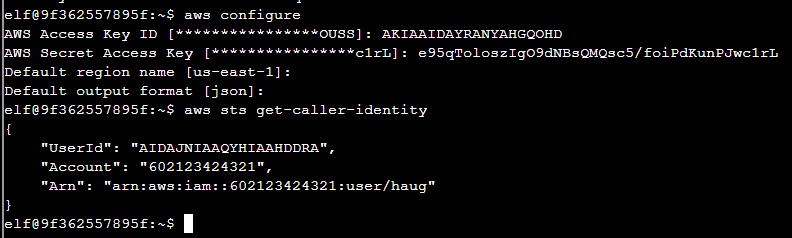

---

### 2:

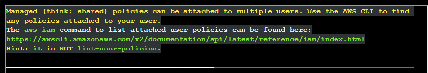
1. We can return this info by running `aws iam list-attached-user-policies`. Since we've already authenticated as `user/haug`, it contextually knows to return those attached to our user.

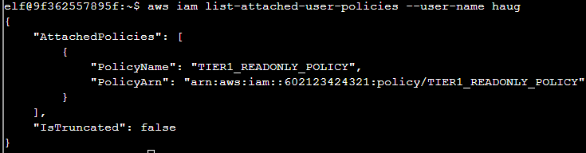

---

### 3:

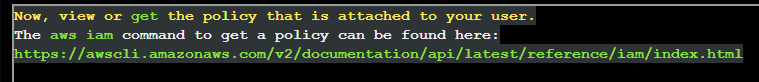

1. We can return this info by running `aws iam get-policy --policy-arn arn:aws:iam::602123424321:policy/TIER1_READONLY_POLICY` , where the arn was grabbed from listing the policies attached to our user in step 2.

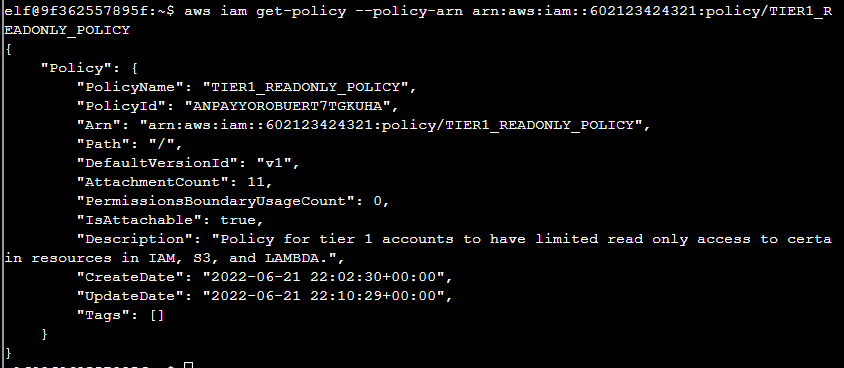

---

### 4:

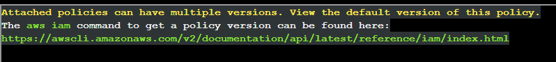

1. We can return this info by running `aws iam get-policy-version --policy-arn arn:aws:iam::602123424321:policy/TIER1_READONLY_POLICY --version-id v1`, where the version `v1` was grabbed from the previous step (where it told us the default version).

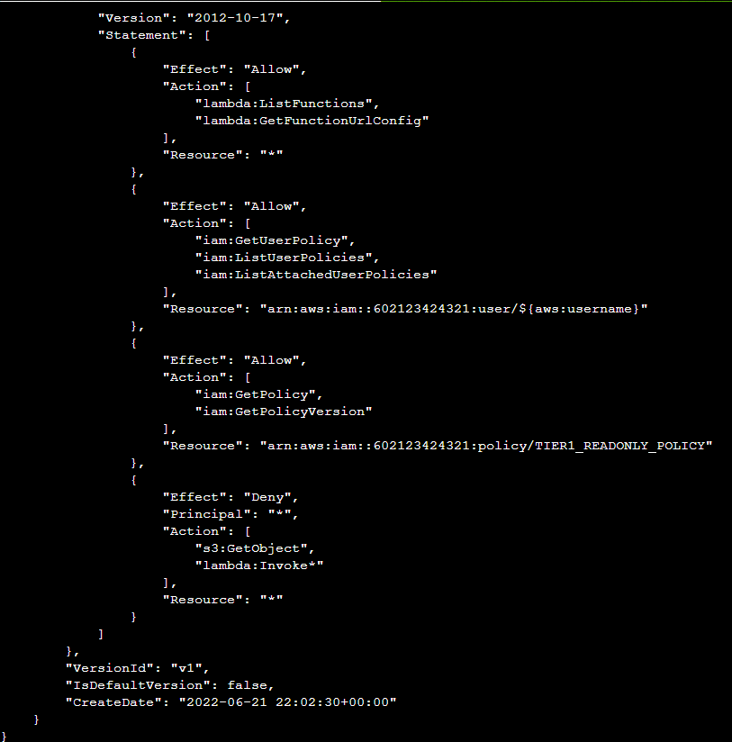
(image is truncated at the top)

---

### 5:

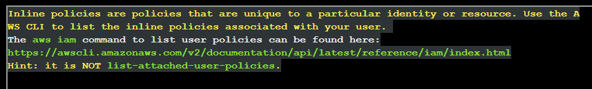

1. We can return this info by running `aws iam list-user-policies --user-name haug`.

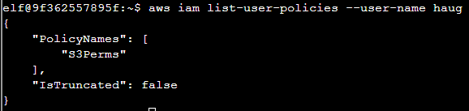

---

### 6:

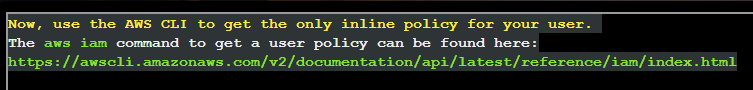

1. We can return this info by running `aws iam get-user-policy --user-name haug --policy-name S3Perms`, where `S3Perms` was determined to be attached to the user `haug` in the previous step.

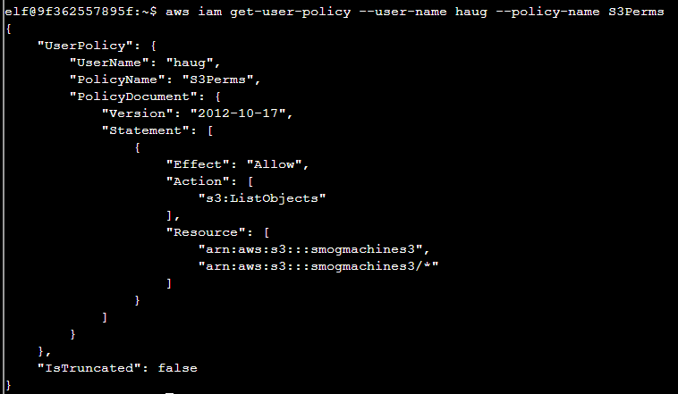

---

### 7:

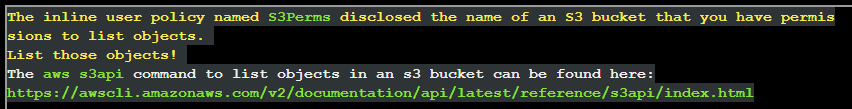

1. In the previous step, we found that the `S3Perms` policy attached to the user allows `s3:ListObjects` permission to the s3 bucket called `smogmachines3`. 
2. So, we can leverage this permission to list the objects in the bucket by running `aws s3api list-objects --bucket smogmachines3`.

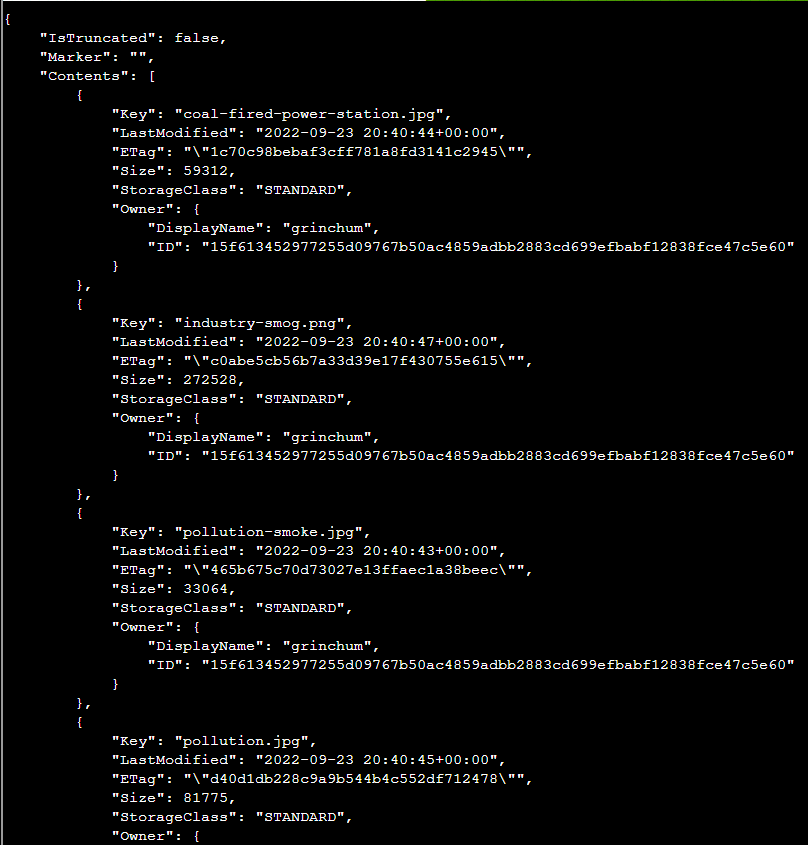
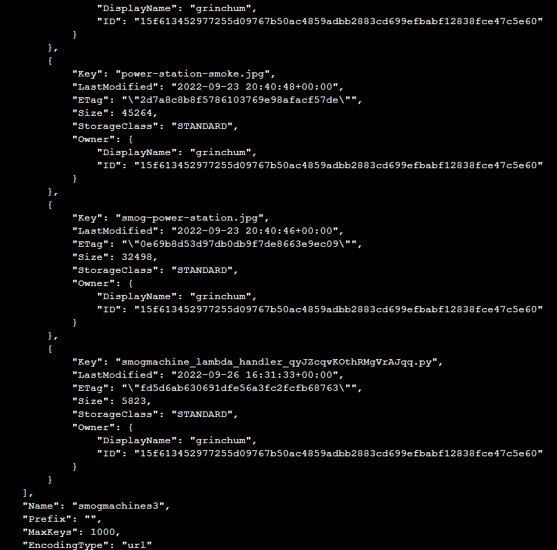

---

### 8:

1. We can return the lambda functions by running `aws lambda list-functions`.

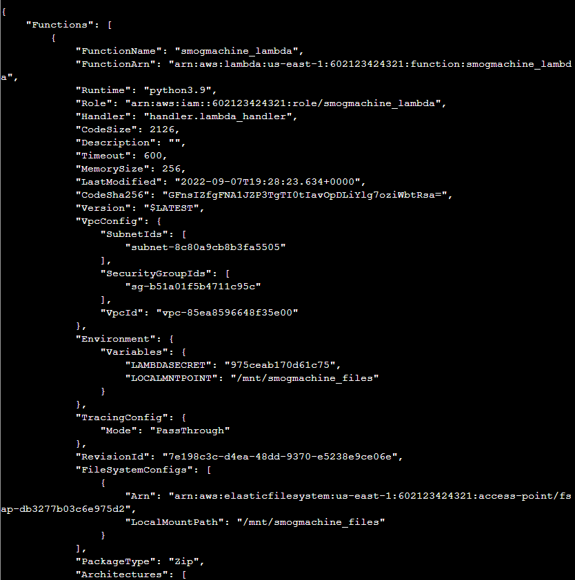
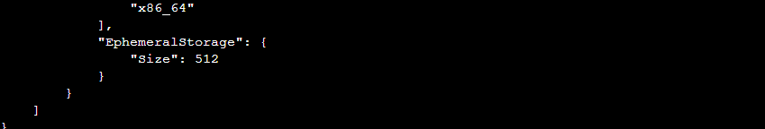

---

### 9:

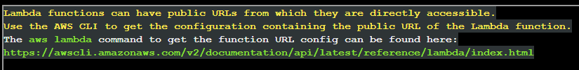

1. We captured the lambda name in the previous step, so we can return the public URL for this function by running `aws lambda get-function-url-config --function-name smogmachine_lambda`.

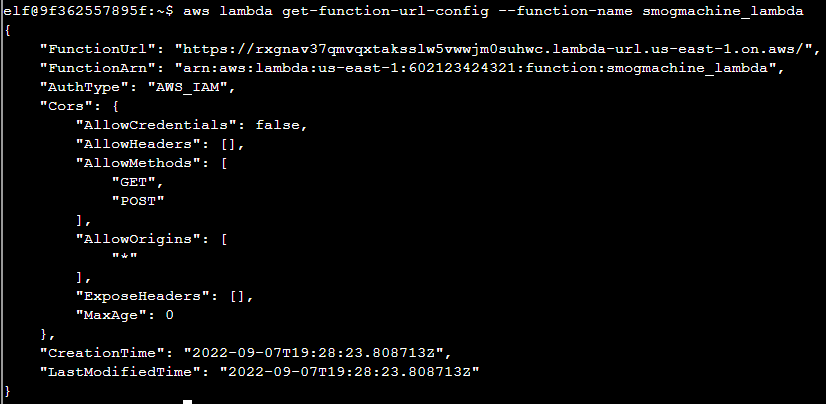

---

And we have completed the challenge! Back to the [cloud ring room](../README.md).

