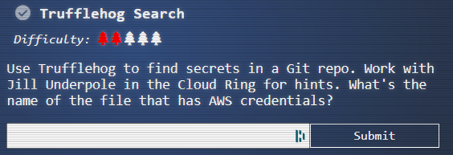
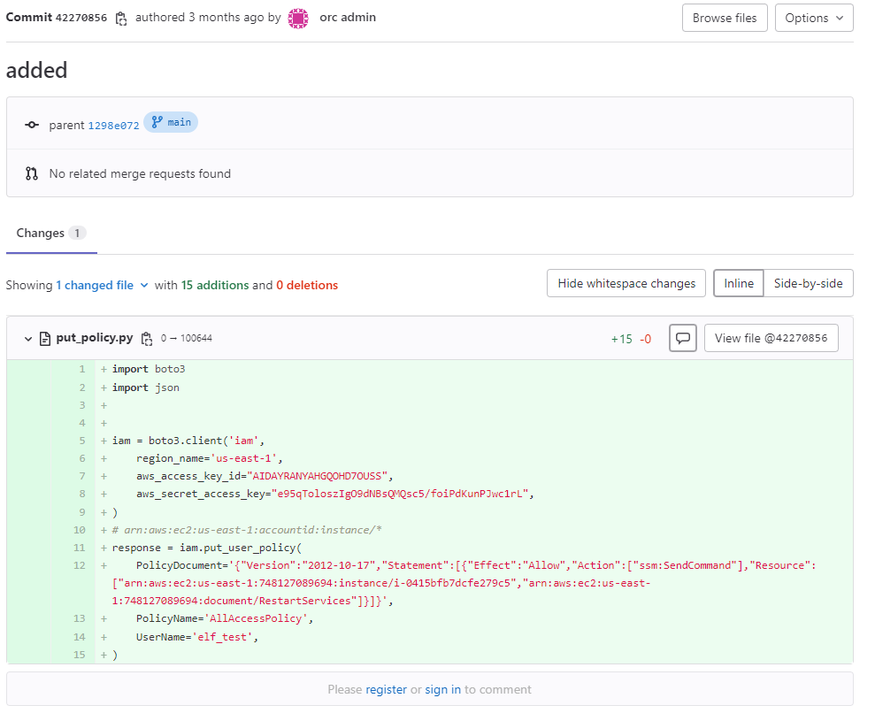

### NOTE: Apparently this was intended to be solved using a tool called `trufflehog`. I didn't do that. Oops.

- The [Gitlab link provided](https://haugfactory.com/orcadmin/aws_scripts) takes us to a repo called `aws_scripts`, owned by `orc admin` organization. 

- This repo has 22 commits - based on the conversation with `Gerty Snowburrow`, we know that `Alabaster Snowball` committed a change with secrets. It's unlikely it's in the current master branch, so let's poke in the commit history.

- I cloned the git repo locally as I'm more comfortable in command line than the web UI, and ran `git log -p | grep secret`. We immediately find our hit:

```
-    aws_secret_access_key="e95qToloszIgO9dNBsQMQsc5/foiPdKunPJwc1rL",
+    aws_secret_access_key=SECRETACCESSKEY,
-    aws_secret_access_key=SECRETACCESSKEY,
+    aws_secret_access_key="e95qToloszIgO9dNBsQMQsc5/foiPdKunPJwc1rL",
+if ('secrets' in arguments):
+    thread_list.append(awsthread.AWSThread('secrets', security.get_secrets_inventory, ownerId, profile_name, boto3_config, selected_regions))
+def get_secrets_inventory(oId, profile, boto3_config, selected_regions):
+        Returns all secrets managed by AWS (without values of the secrets ;-)
+        :return: secrets inventory
+        aws_service = "secretsmanager",
+        function_name = "list_secrets",
-    aws_secret_access_key="e95qToloszIgO9dNBsQMQsc5/foiPdKunPJwc1rL",
+    aws_secret_access_key=SECRETACCESSKEY,
+    aws_secret_access_key="e95qToloszIgO9dNBsQMQsc5/foiPdKunPJwc1rL",
```

- Since we know a key to look for, I run `git log -p | grep e95qToloszIgO9dNBsQMQsc5 -b20`, and find in my output a commit that was made by `asnowball <alabaster@northpolechristmastown.local>` where the change is present:

```
93889-commit 422708564ef952ff28ce719ab6dc15002fa84a6e
93937-Author: asnowball <alabaster@northpolechristmastown.local>
93996-Date:   Tue Sep 6 13:10:48 2022 -0700
94034-
94035-    added
94045-
94046-diff --git a/put_policy.py b/put_policy.py
94089-new file mode 100644
94110-index 0000000..57ed9a6
94133---- /dev/null
94147-+++ b/put_policy.py
94167-@@ -0,0 +1,15 @@
94184-+import boto3
94198-+import json
94211-+
94213-+
94215-+iam = boto3.client('iam',
94242-+    region_name='us-east-1',
94272-+    aws_access_key_id="AIDAYRANYAHGQOHD7OUSS",
94320:+    aws_secret_access_key="e95qToloszIgO9dNBsQMQsc5/foiPdKunPJwc1rL",
```

- Back in Gitlab, I search for the commit ID from above, `422708564ef952ff28ce719ab6dc15002fa84a6e`, and we find our answer.



Answer: `put_policy.py`
