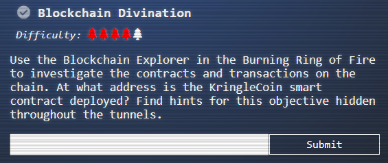
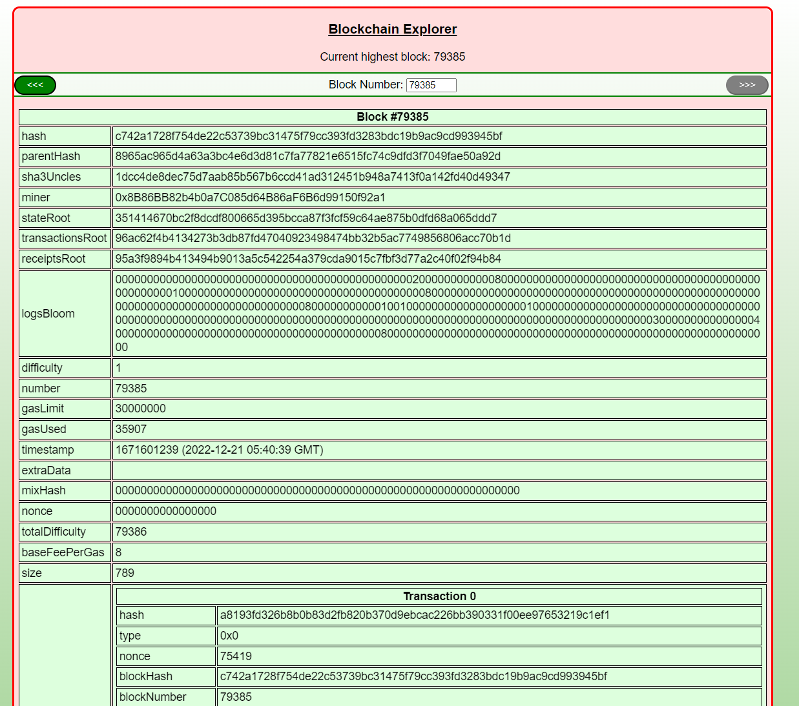
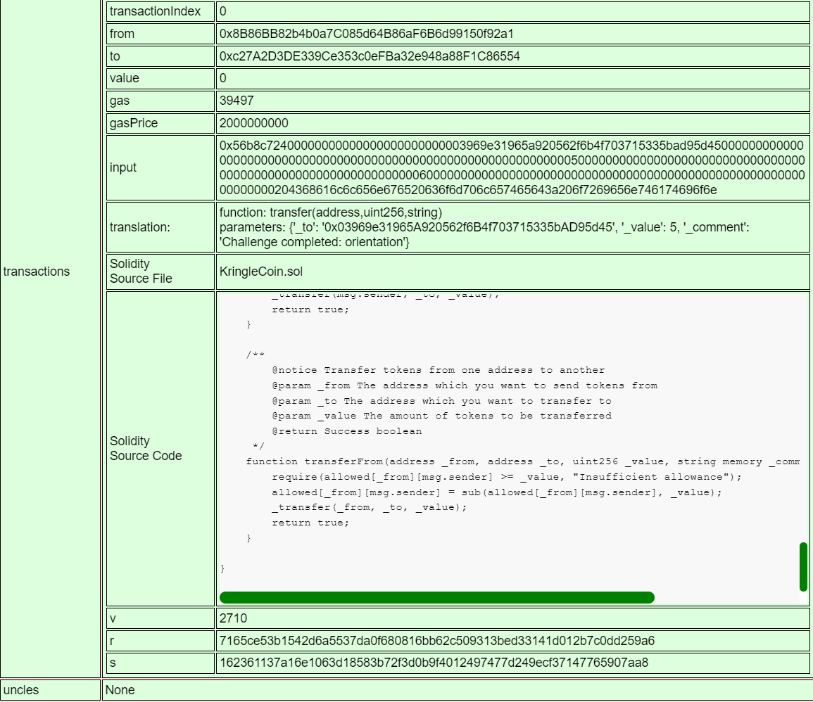
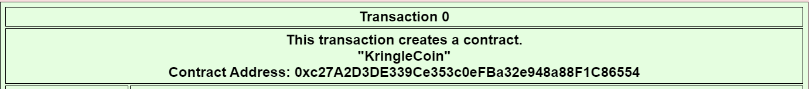

# Blockchain Divination

- When we come into the challenge, we see the most recent block number's information:

- The only thing we can control on the page is what block number we're looking at. Since the question is asking us `At what address is the KringleCoin smart contract deployed?`, we're most likely to find the answer by viewing block 1 of the smart contract.

- Low and behold, we see that block 1 clearly provides us the answer.

Answer: **0xc27A2D3DE339Ce353c0eFBa32e948a88F1C86554**

Back to the [burning ring of fire room](../README.md)!