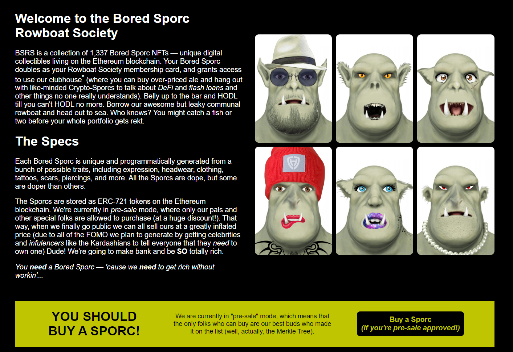
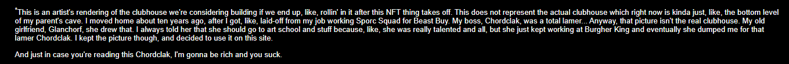
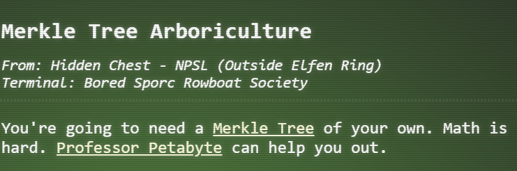
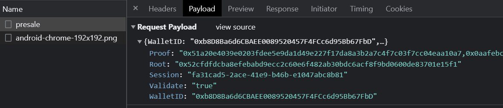
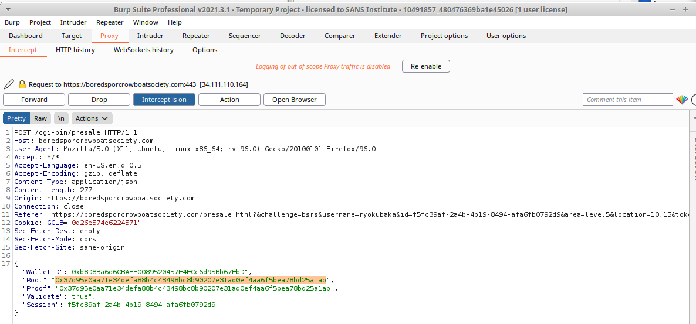
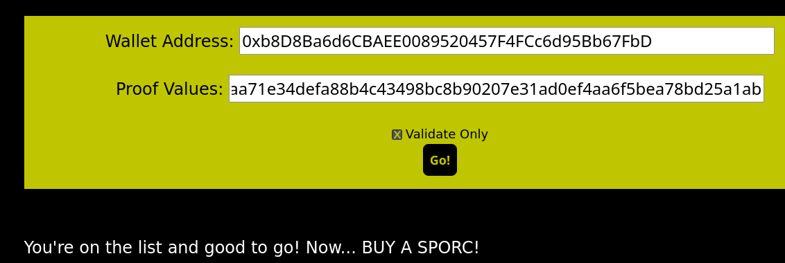
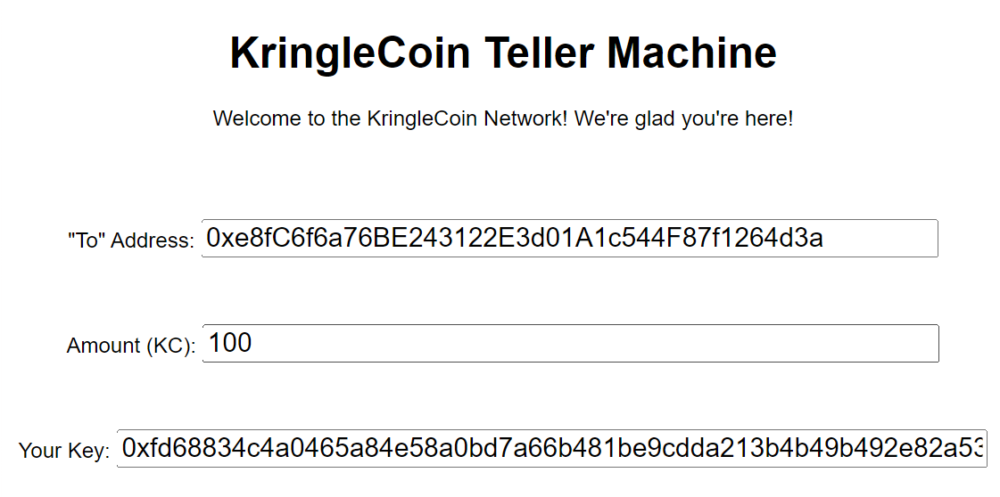
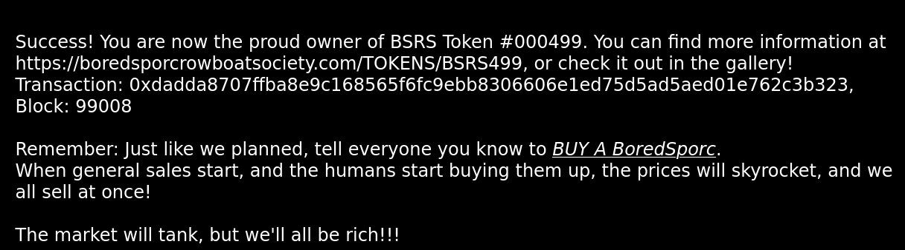
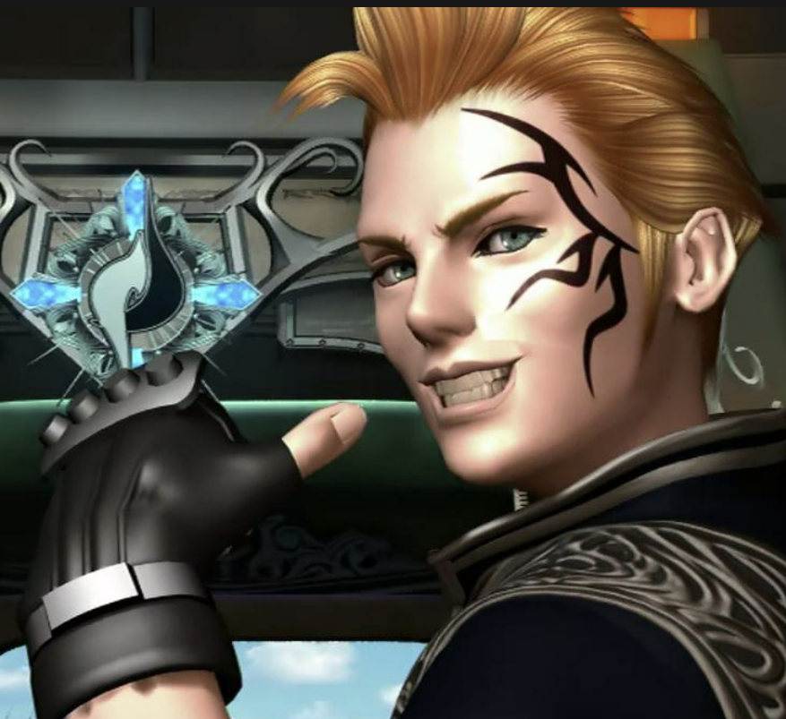

# Bored Sporc Rowboat Society



- We are taken to a webpage where we can buy sporcs, which are NFTs, as part of a pre-sale.

- I love the end of this note at the bottom of the site. Very nice.



- This is the first time I think I need a hint. Thankfully, as this is our last challenge, we have one!



- [Merkle Tree](https://decentralizedthoughts.github.io/2020-12-22-what-is-a-merkle-tree/)
- [Professor Petabyte](https://www.youtube.com/watch?v=Qt_RWBq63S8)

- Reading through Merkle Tree's and watching Professor Petabyte's video was interesting, but what was even more interesting was seeing that Professor Petabyte has a [twitter](https://twitter.com/QPetabyte) page, where they linked to their [github repo](https://github.com/QPetabyte/Merkle_Trees) with some fancy scripts related to Merkle Trees.

- If we inspect the traffic when we attempt a "Validation", we actually see that in the payload it sends not only our wallet address and the proof values (which we inputted into the form), but also the `Root` node address.



- The python script that was in the Professor's Github repo allows us to generate a root address and proof addresses, where we can include our own wallet address. I simply modified the `allowlist` to include my wallet address:

```
allowlist = ['0xb8D8Ba6d6CBAEE0089520457F4FCc6d95Bb67FbD',
             '0x0000000000000000000000000000000000000000']
```

Which provided me with:

```
Root: 0x1d5aa70eee8c863e436cbdcf0b4bc028b774ebf1114645bcf3b3590626055511
Proof: ['0x37d95e0aa71e34defa88b4c43498bc8b90207e31ad0ef4aa6f5bea78bd25a1ab']
```

- I then put those values into the website, and turned on Burp as a proxy to catch the request and modified the request with my newly generated root:
 


- And it works!
 


- Now that we know it works, I need to pre-approve a 100 KC transfer to the address they provided for the pre-sale, `0xe8fC6f6a76BE243122E3d01A1c544F87f1264d3a`. We go upstairs to the KTC and follow a similar process as we did for buying a hat:



- I go back to the BSRS page and follow the same exact steps as I did previously, but with the `Validate Only` checkbox un-checked. 



- We are the proud owner of BSRS Token #000499!!


- His face tattoo reminds me of Zell from Final Fantasy VIII:



- Anyway - we obtained the last objective, and the **`Burning Ring of Fire`** along with it!! Let's head back to the [Northpole](../../../2-northpole/1-northpole.md) and see if we can do anything there now. 