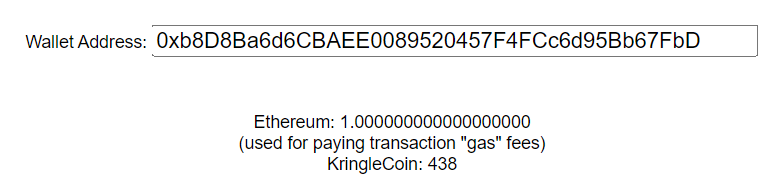
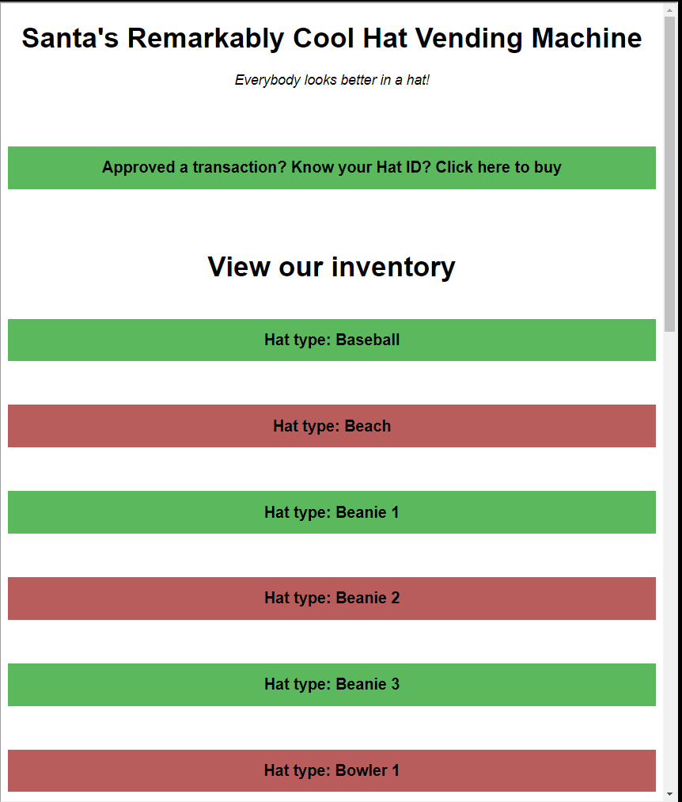
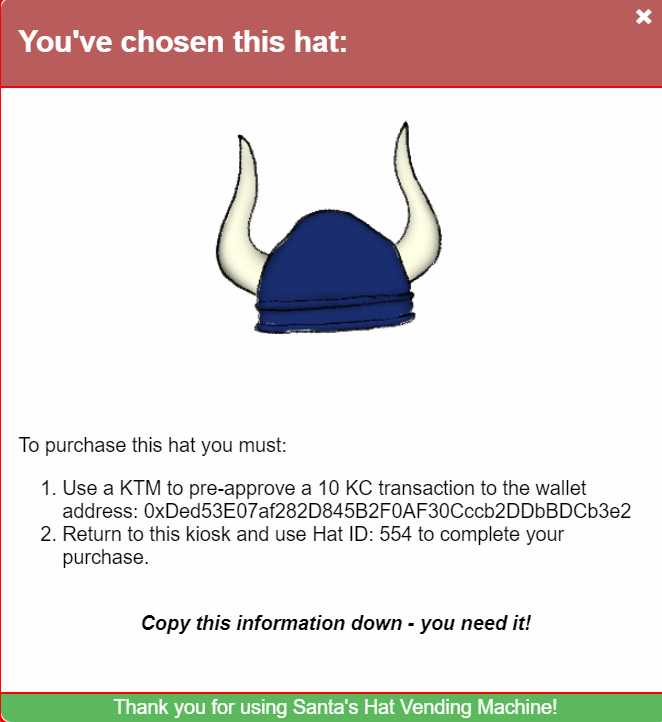
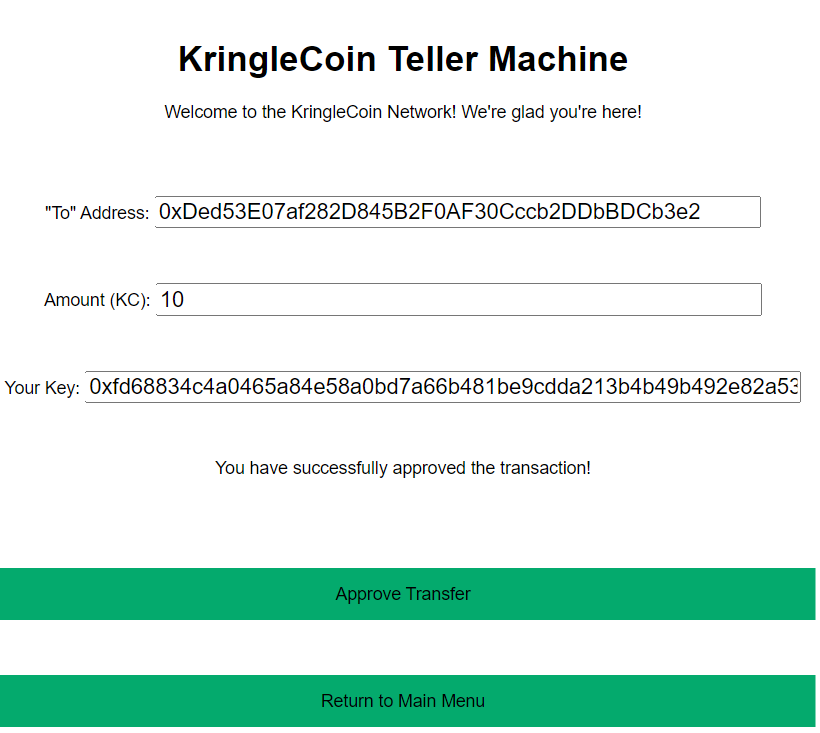
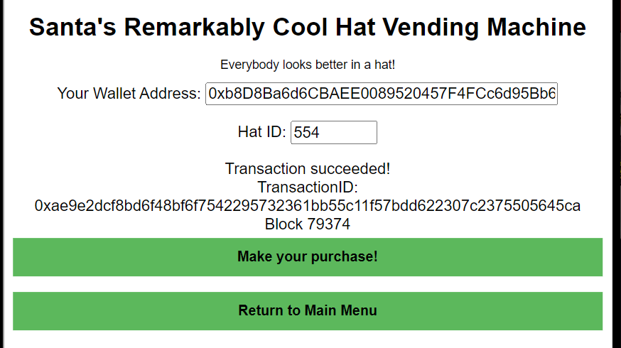

# Hats, hats, hats

The first thing I wanted to do here was check my balance at the KTM.

When we look into the vending machine, we see all kinds of different hats:

I decided to test the waters by buying this sick viking hat. I needed to approve a 10 KC transaction to the wallet address `0xDed53E07af282D845B2F0AF30Cccb2DDbBDCb3e2` with a Hat ID `554`.

I approve the transaction at the KTM:

Then return to the vending machine to make my purchase:

Back to the [burning ring of fire room](../README.md)!