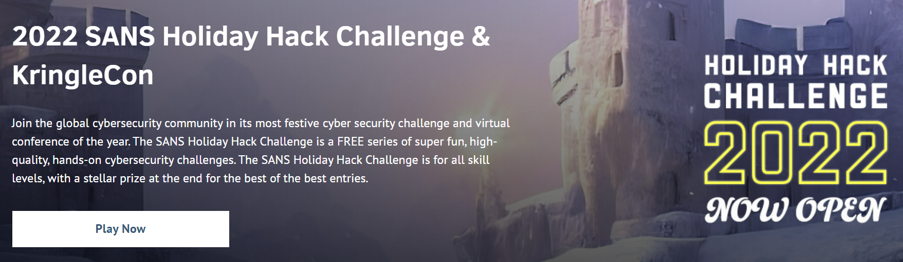

# 2022 SANS Holiday Hack Challenge & KringleCon - Write Up



Welcome to my write-up for the 2022 SANS Holiday Hack Challenge! This is the first year I coerced myself into documenting my solutions, and I found the process quite enjoyable.

The SANS Holiday Hack Challenge (HHC) is an event put on annually in December that brings competitors into a virtual landscape where they navigate KringleCon and help save Christmas.

I can do no better of an introduction to the challenge than the authors themselves, so I will simply provide their description below from the [website](https://www.sans.org/mlp/holiday-hack-challenge/):

```
Welcome to the annual SANS Holiday Hack Challenge, featuring KringleCon, is a FREE series of super fun, high-quality, 
hands-on cybersecurity challenges for all skill levels. This unique experience includes real-world challenges and a 
quirky holiday-themed storyline where you get to save the holiday season from a cyber-attack. You can create your 
customized avatar and partner with teammates, friends, and players from around the globe in this one-of-a-kind shared 
virtual experience.

The SANS Holiday Hack Challenge includes a built-in virtual conference called KringleCon. Now in its fifth year, 
KringleCon V: Golden Rings features fascinating talks from cybersecurity industry experts on the latest and most 
relevant infosec topics (some of which will help you solve the SANS Holiday Hack Challenge). Plus, Santa will share 
a playlist of newly minted holiday songs to inspire your cybersecurity work.
```

---

With that introduction out of the way - let's just head right into it. We start in the [orientation room!](1-orientation/1-orientation.md) Or, you can jump straight to a challenge from the chart below.

| **Challenge Title** | **Room Location** | **Challenge Write-Up** |
| --- | --- | --- |
| Wireshark Practice | [Tolkien](3-rings/1-tolkien/README.md) | [link](3-rings/1-tolkien/suspiciouspcap/README.md) |
| Windows Event Logs | [Tolkien](3-rings/1-tolkien/README.md) | [link](3-rings/1-tolkien/windowseventlogs/README.md) |
| Suricatta Regatta | [Tolkien](3-rings/1-tolkien/README.md) | [link](3-rings/1-tolkien/suricataregatta/README.md) |
| Clone with a Difference | [Elfen](3-rings/2-elfen/README.md) | [link](3-rings/2-elfen/clonewithadifference/README.md) |
| Prison Escape | [Elfen](3-rings/2-elfen/README.md) | [link](3-rings/2-elfen/prisonescape/README.md) |
| Jolly CI/CD | [Elfen](3-rings/2-elfen/README.md) | [link](3-rings/2-elfen/jollycicd/README.md) |
| Naughty IP | [Web](3-rings/3-web/README.md) | [link](3-rings/3-web/boriaChallenges/README.md) |
| Credential Mining | [Web](3-rings/3-web/README.md) | [link](3-rings/3-web/boriaChallenges/README.md) |
| 404 FTW | [Web](3-rings/3-web/README.md) | [link](3-rings/3-web/boriaChallenges/README.md) |
| IMDS, XXE, and Other Abbreviations |[Web](3-rings/3-web/README.md) | [link](3-rings/3-web/boriaChallenges/README.md) |
| Open Boria Mine Door | [Web](3-rings/3-web/README.md) | [link](3-rings/3-web/boriaminedoor/README.md) |
| Glamtariel's Fountain | [Web](3-rings/3-web/README.md) | [link](3-rings/3-web/glamtarielsfountain/README.md) |
| AWS CLI Intro | [Cloud](3-rings/4-cloud/README.md) | [link](3-rings/4-cloud/awscliintro/README.md) |
| Trufflehog Search | [Cloud](3-rings/4-cloud/README.md) | [link](3-rings/4-cloud/gitsecrets/README.md) |
| Exploitation via AWS CLI | [Cloud](3-rings/4-cloud/README.md)  | [link](3-rings/4-cloud/awsexploitcli/README.md) |
| Buy a Hat | [Burning Ring of Fire](3-rings/5-burningringoffire/README.md) | [link](3-rings/5-burningringoffire/hat/README.md) |
| Blockchain Divination | [Burning Ring of Fire](3-rings/5-burningringoffire/README.md) | [link](3-rings/5-burningringoffire/blockchain/README.md) |
| Exploit a Smart Contract | [Burning Ring of Fire](3-rings/5-burningringoffire/README.md) | [link](3-rings/5-burningringoffire/bsrs/README.md) |
| Finale | [Finale](2-northpole/3-finale.md) | [link](2-northpole/3-finale.md) |

